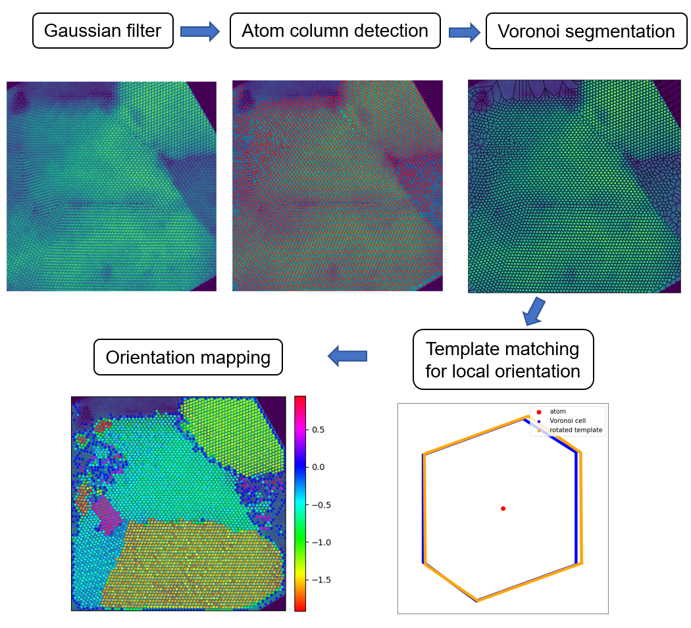

# Lattice-based Grain Segmentation for HRTEM images and videos

 

  <h3 align="center">an automated atomic resolution TEM image process and analysis pipeline</h3>
  

     
     
     
  

<!-- TABLE OF CONTENTS -->

  
Table of Contents

  <ol>
    <li>
      <a href="#about-the-project">About The Project</a>
    </li>
    <li><a href="#roadmap">Roadmap</a></li>
    <li><a href="#contact">Contact</a></li>
    <li><a href="#acknowledgments">Acknowledgments</a></li>
  </ol>

<!-- ABOUT THE PROJECT -->
## About The Project

Atomic resolution transmission electron microscopy (TEM) image gives tremendous structural imformation of the materials. However, only limited information was utilized in most of the TEM related researches due to the great challenge in quantatitive analysis of TEM images. And the quality of data analysis relies very much on the experience of the researchers. For in situ atomic resolution TEM, the challange is even greater since the dataset typically contains thousands of images.  
To tackle this issue, automating image process and data mining process is necessary. One of the most important tasks is the grain segmentation, which could give the morphologies of nanocrystals and the grain boundaries of polycrystals. This is also the prerequsite step for automated strain analysis, defect analysis, etc. 
Therefore, for this project, we are motivated to develop automated grain segmentation alogrithm for atomic resolution TEM images (HRTEM, STEM, etc.) of crystalline samples based on lattice pattern. 
There are mainly three modules: atom orientation mapping, grain segmentation and atom tracing. 

### Atom orientation mapping

In HRTEM images, atom columns are visible when the crystal is on zone axis. The orientation of atoms can be determined from the arrangement of the neighbor atoms. Here we borrow the idea of template matching (P. M. Larsen et al. Robust Structural Identification via Polyhedral Template Matching, Modelling Simul. Mater. Sci. Eng. 24, 055007 (2016), doi:10.1088/0965-0393/24/5/055007). Following is the flowchart:  
  
Image is first processed by FFT filter. Then atoms in the image are detected by LoG blob detection. Voronoi analysis is used to represent the local environment of atoms. Template matching is therefore conducted on each voronoi cell of the atoms, yielding the orientation of the atoms. In this way, we get the atom orientation mapping.  
For the usage, please refer to Atom_orientation_mapping.ipynb.

### Grain segmentation

The feature used for grain segmentation of HRTEM images is the lattice translational symmetry, which is reflected in the FFT patterns. In the FFT space, the periodic order is reflected as peaks of amplitude, while the location information is saved in the imaginary part of the FFT signal. For one grain, it has multiple orders (periodicity of atomic planes). By utilizing this characteristic, we conduct the grain segmentation in the following order.   
  
FFT was firstly performed on the HRTEM image. Then diffraction spots was detected using LoG blob detection. Then each spot was selected and masked for inverse FFT, which gives the rough location for the origin of that order (grain location). By comparing the overlapping, we can find the spots (periodic orders) for the same grain. These spots are grouped as the spots for same grain. Then, we select and mask the spots for same grain, perform inverse FFT and get the real space image that filtered other forbidden orders. After that, LoG blob detection was used to detect atom locations in the iFFT images. This gives the atom locations for that grain. However, due to the signal leakage issue of cropped FFT, the observed order in iFFT image would be larger than the real periodic order of that grain. Therefore, more atoms would be detected in iFFT image than the real case. To takle this issue, we also perform LoG detection in the original image. By comparing the atom locations in iFFT image and original image, we then filtered the falsely detected atoms in iFFT image. (Due to the probable overlap of falsely detected atoms with real atomic locations, this process is complicated. It was solved by s-t graph cut.) By repeating this on the FFT spots of each grain, we finally get the atoms labelled based on the parent grains.   
For the usage, please refer to Grain_Segmentation_HRTEM.ipynb.

### Atom trajectory tracking
Motions of atoms between frames are traced in in situ videos with atomic resolution. For example, in the following images showing the shear displacement of two grains caused by shear coupled grain boundary migration, The atomic displacement is plotted:  
  
Statistical analysis can be conducted on the distribution of the atom displacement:  
  
This can be used to reflect and analyze the displacement of atoms driven by stress, diffusion, etc. 
For the usage, please refer to Atom trajectory tracing.ipynb. 

(<a href="#readme-top">back to top</a>)

<!-- ROADMAP -->
## Roadmap

- [x] Atom orientation mapping
- [x] Grain segmentation
- [ ] Polycrystal strain mapping
- [ ] Crystallographic defect detection

(<a href="#readme-top">back to top</a>)

<!-- CONTACT -->
## Contact

Yuan Tian - tiany17@uci.com

(<a href="#readme-top">back to top</a>)

<!-- ACKNOWLEDGMENTS -->
## Acknowledgments

This project is supported by Army Research Office (ARO) Project about grain boundary dynamics. The code was developed initially for the analysis of in situ videos of grain boundary dynamics in polycrystal materials. 

(<a href="#readme-top">back to top</a>)

